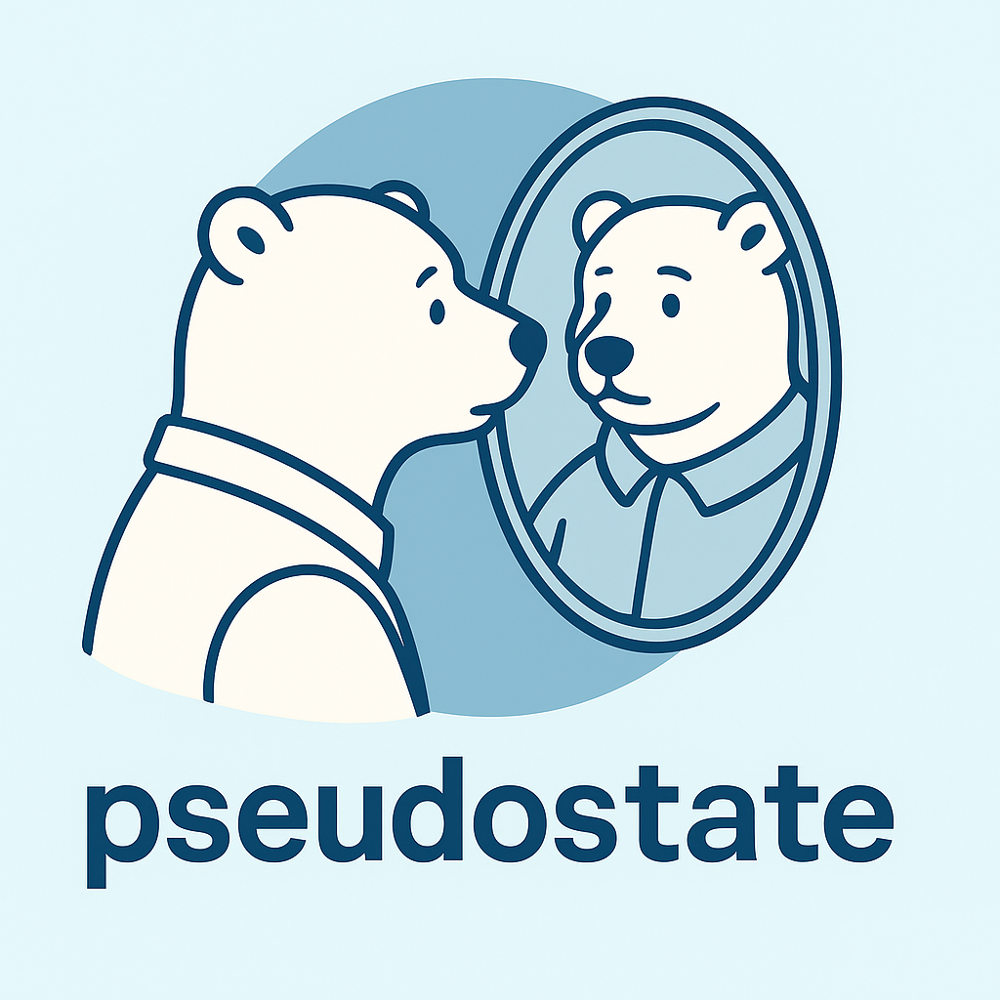

# Get started



`pseudostate` computes Aalen-Johansen pseudo-observations at a fixed time horizon. These pseudo-observations can be used as individual-level outcomes in regression models for cumulative incidence or state occupation probabilities.


# Installation

With [uv](https://docs.astral.sh/uv/):

``` bash
uv add pseudostate
```

Alternatively, with pip:

``` bash
pip install pseudostate
```


# A reproducible example


``` python
import polars as pl
from pseudostate import calculate_pseudostates

times_and_reals = pl.DataFrame(
    {
        "times": [1, 2, 2, 3, 4, 5, 6],
        "reals": [1, 0, 2, 1, 0, 2, 1],
    }
)

calculate_pseudostates(times_and_reals, fixed_time_horizon=5)
```


shape: (7, 6)

| estimate_origin | times | state_occupancy_probability_0 | state_occupancy_probability_1 | state_occupancy_probability_2 | row_id |
|----|----|----|----|----|----|
| enum | f64 | f64 | f64 | f64 | i32 |
| "fixed_time_horizons" | 5.0 | 0.0 | 1.0 | 4.4409e-16 | 0 |
| "fixed_time_horizons" | 5.0 | 0.375 | 0.25 | 0.375 | 1 |
| "fixed_time_horizons" | 5.0 | 0.0 | 0.0 | 1.0 | 2 |
| "fixed_time_horizons" | 5.0 | -0.125 | 1.25 | -0.125 | 3 |
| "fixed_time_horizons" | 5.0 | 0.541667 | -0.083333 | 0.541667 | 4 |
| "fixed_time_horizons" | 5.0 | -0.791667 | -0.083333 | 1.875 | 5 |
| "fixed_time_horizons" | 5.0 | 1.875 | -0.083333 | -0.791667 | 6 |


# Background

The theoretical foundation for pseudo-observations in multi-state models was laid out by Andersen, Klein, and Rosthøj (2003), *Generalised linear models for correlated pseudo-observations, with applications to multi-state models*, *Biometrika*, 90(1), 15-27.

The [`pseudo`](https://cran.r-project.org/package=pseudo) R package provides a widely used implementation of this approach.


### Links

[View on PyPI](https://pypi.org/project/pseudostate/)\


### AI / Agents

[Skills](skills.md)\
[llms.txt](llms.txt)\
[llms-full.txt](llms-full.txt)\


### Developers


**Uriah Finkel**

<span style="margin-top: -0.15em; display: block;">[](mailto:ufinkel@gmail.com "Email")</span>


### Meta

**Requires:** Python `>=3.13`\
[Package Info](package-info.md)
